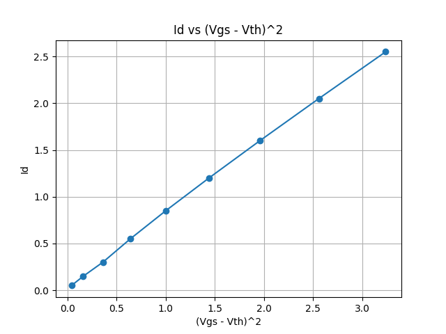

# MOSFET_IdVgs_Analysis
Analysis of MOSFET Id-Vgs characteristics and transconductance (gm) using Python
## Question 
- Id는 Vgs에 따라 어떤 형태로 증가하는가?
- 문턱 전압 근처에서 gm은 왜 급격히 증가하는가?

## Plan
- 가상 또는 측정 데이터를 사용하여 Id–Vgs 특성 분석
- Python으로 데이터 시각화
- gm = dId/dVgs 계산
- 결과에 대한 물리적 해석 정리

## Result:Id–Vgs 
-

## Observation
- Id는 약 Vgs=1.2까지 0이다.
- Id는 Vgs=1.2 이후로는, 비선형적으로 증가한다.
  
## Interpretation
- Vgs가 약 1.2V이하에서는 MOSFET이 꺼진 상태로 채널 형성이 되지 않아 드레인 전류가 거의 흐르지 않는다.
- Vgs가 문턱 전압을 초과하면 채널이 형성되며, Id는 (Vgs-Vth)에 의존하여 비선형적으로 증가한다.

## Next Question
- Id는 왜 Vgs에 대해 선형이 아닌 비선형적으로 증가하는가?
- 이러한 비선형성은 gm특성에 어떤 영향을 미치는가?

## Next Plan
- 문턱 전압 이후 구간(Vgs > Vth)만 추출
- Id vs (Vgs − Vth)² 관계 확인

## Result:Id_vs_Vgs_minus_Vth_square
- 

