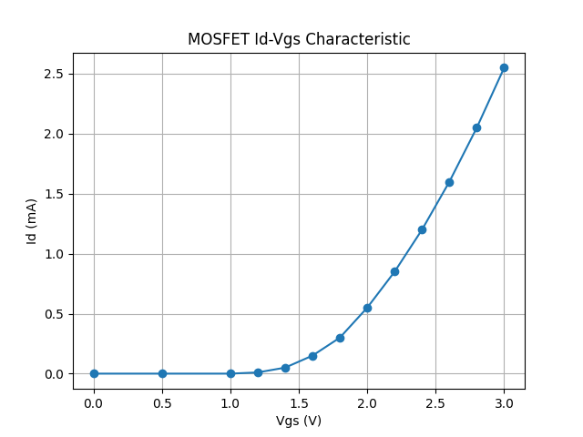

# MOSFET_IdVgs_Analysis
Analysis of MOSFET Id-Vgs characteristics and transconductance (gm) using Python
## Question
- Id는 Vgs에 따라 어떤 형태로 증가하는가?
- 문턱 전압 근처에서 gm은 왜 급격히 증가하는가?

## Plan
- 가상 또는 측정 데이터를 사용하여 Id–Vgs 특성 분석
- Python으로 데이터 시각화
- gm = dId/dVgs 계산
- 결과에 대한 물리적 해석 정리

## Result:Id–Vgs 
-

## Observation
- Id는 약 Vgs=1.2까지 영이다.
- Id는 Vgs=1.2 이후로는, 비선형적으로 증가한다.
